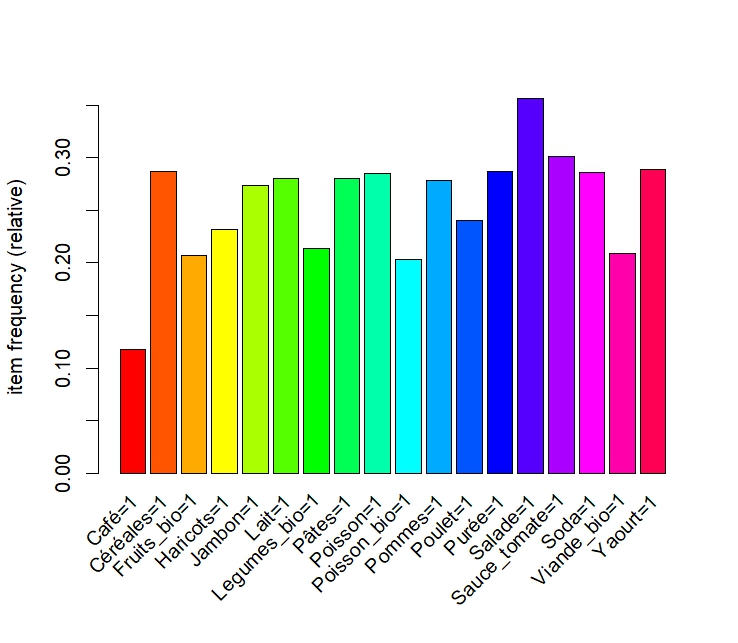
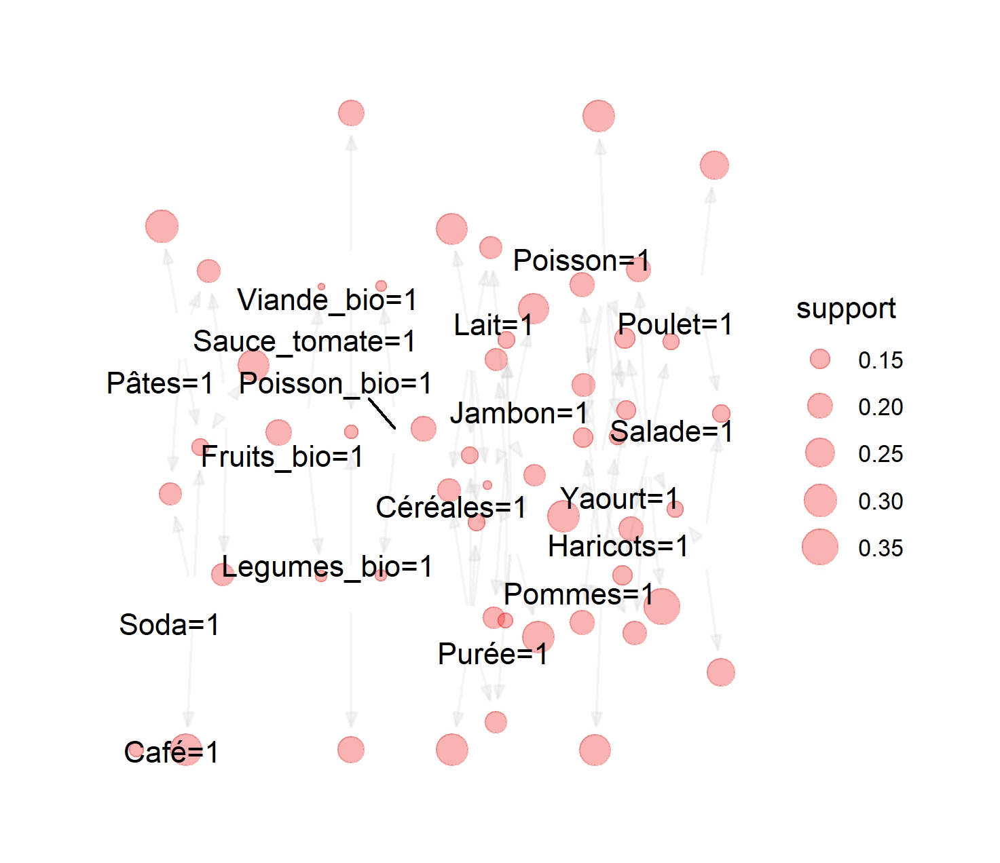
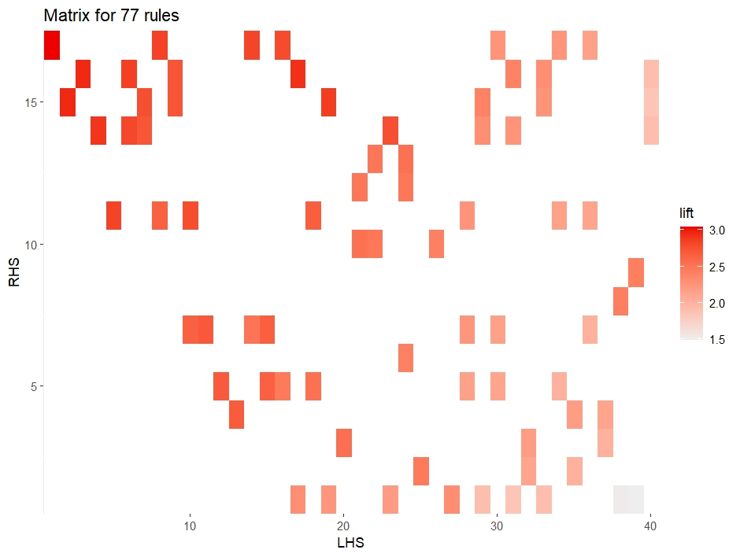
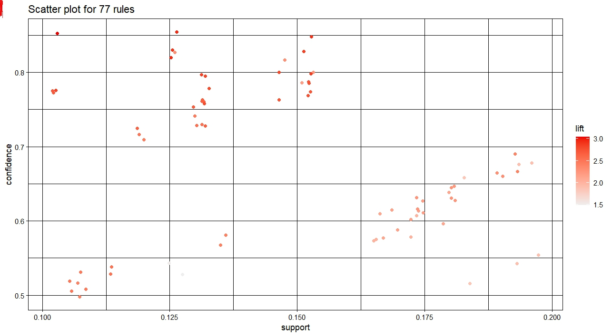
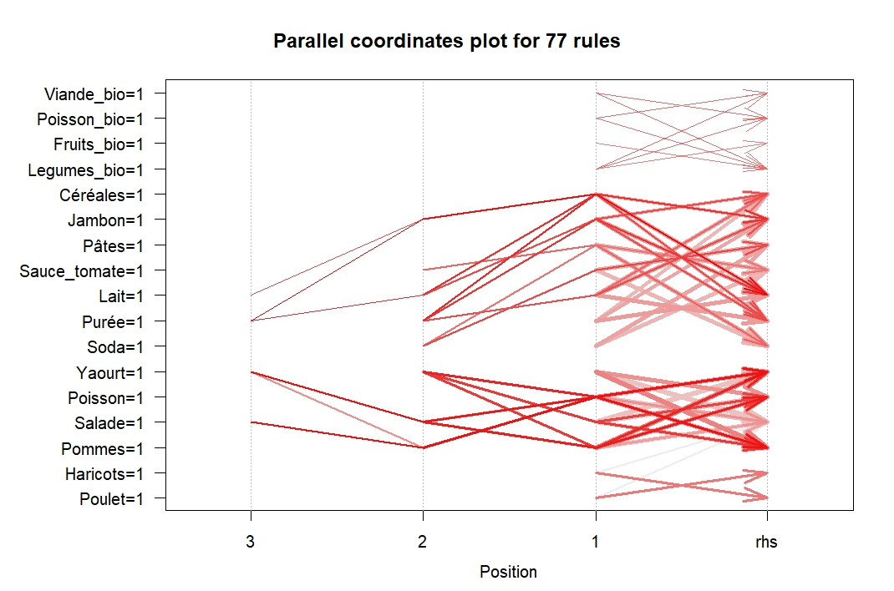
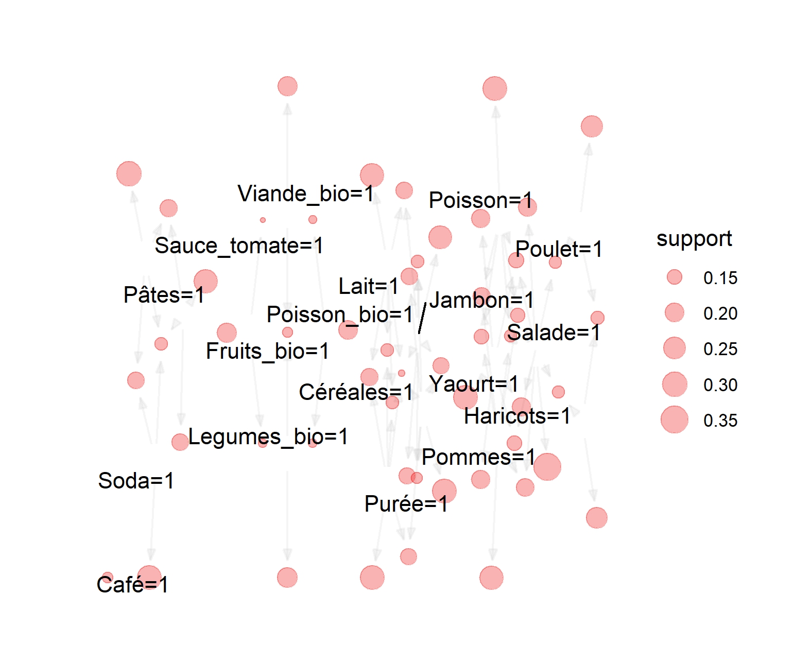
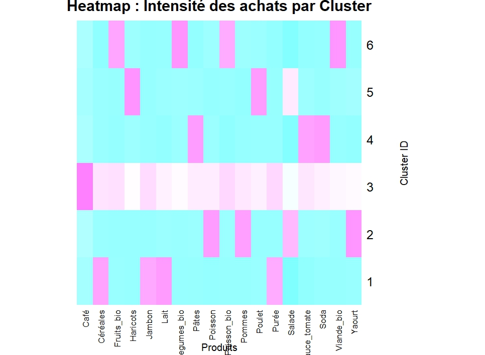
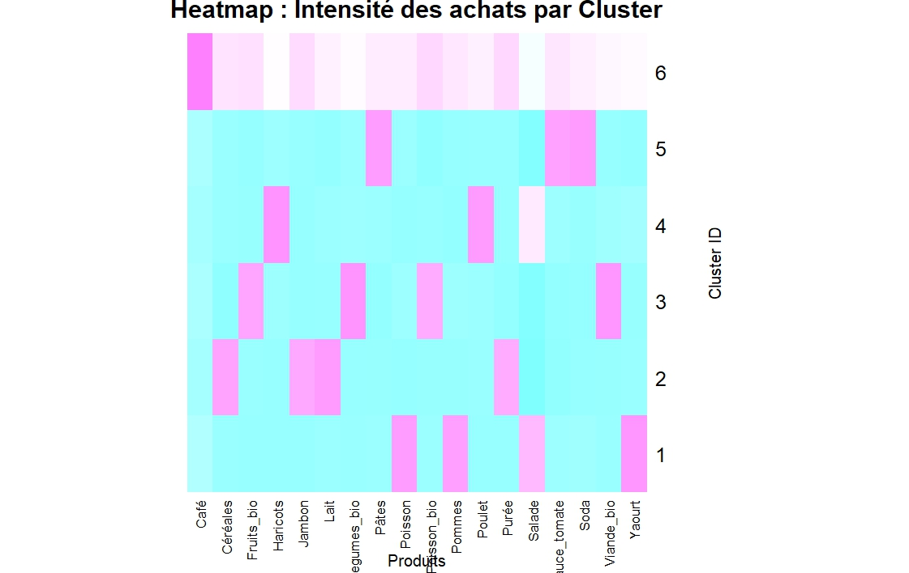

# 🛒 Analyse de Données — Règles d'Association & Clustering

> **Projet universitaire — Master Ingénierie Mathématique (Semestre 1)**  
> Analyse d'un dataset de paniers d'achat supermarché avec l'algorithme **Apriori** et le **K-Means clustering** en R.

---

## 📋 Table des Matières

1. [Présentation du Projet](#-présentation-du-projet)
2. [Dataset](#-dataset)
3. [Librairies R Utilisées](#-librairies-r-utilisées)
4. [Partie I — Exploration & Préparation des Données](#-partie-i--exploration--préparation-des-données)
5. [Partie II — Extraction des Itemsets Fréquents](#-partie-ii--extraction-des-itemsets-fréquents)
6. [Partie III — Règles d'Association](#-partie-iii--règles-dassociation)
7. [Partie IV — Règles par Genre](#-partie-iv--règles-par-genre)
8. [Partie V — Règles par Âge](#-partie-v--règles-par-âge)
9. [Partie VI — Règles par Revenu](#-partie-vi--règles-par-revenu)
10. [Partie VII — Analyse des Transactions Élevées](#-partie-vii--analyse-des-transactions-élevées)
11. [Partie VIII — Clustering K-Means](#-partie-viii--clustering-k-means)
12. [Rapport](#-rapport)

---

## 🎯 Présentation du Projet

Ce projet analyse les comportements d'achat de **2 000 clients** d'un supermarché afin de :

- 🔍 **Identifier les articles fréquemment achetés ensemble** via l'algorithme Apriori
- 📊 **Extraire des règles d'association** selon le genre, l'âge et le niveau de revenu
- 🧩 **Segmenter les clients** en groupes homogènes grâce au clustering K-Means
- 💡 **Profilage socio-démographique** des clusters pour des recommandations marketing ciblées

---

## 📂 Dataset

| Fichier | Description |
|---|---|
| `data/Data_Projet.csv` | Dataset principal — 2 000 transactions, 25 variables |

**Variables principales :**
- **Socio-démographiques** : Genre, Âge, Statut marital, Nb_enfants, Revenu
- **Articles (18 produits)** : Poisson, Pommes, Salade, Yaourt, Pain, Lait, etc. (valeurs 0/1)
- **Transaction** : Montant total de l'achat

---

## 📦 Librairies R Utilisées

```r
install.packages("arules")      # Algorithme Apriori (règles d'association)
install.packages("arulesViz")   # Visualisation des règles
install.packages("clustMixType")# Clustering de données mixtes
install.packages("factoextra")  # Évaluation et visualisation des clusters
library(dplyr)                  # Manipulation de données
```

---

## 🔬 Partie I — Exploration & Préparation des Données

### Chargement des données

```r
basket <- read.csv("Data_Projet.csv", stringsAsFactors = T)
```
> Importe le dataset CSV. `stringsAsFactors=T` convertit automatiquement les colonnes texte en facteurs R.

### Exploration initiale

```r
dim(basket)      # Affiche le nombre de lignes (obs.) et colonnes (variables)
str(basket)      # Résumé de la structure du data frame
summary(basket)  # Statistiques descriptives de toutes les variables
```

| Commande | Résultat attendu |
|---|---|
| `dim(basket)` | `[1] 2000  25` — 2000 observations, 25 variables |
| `str(basket)` | Types de chaque variable (Factor, int, num...) |
| `summary(basket)` | Min, Max, Médiane, Moyenne pour chaque colonne |

### Préparation de la matrice articles

```r
# Sélection des 18 colonnes articles (colonnes 8 à 25)
basket2 <- basket[, c(8:25)]

# Conversion en facteurs avec niveaux 0 et 1
basketF <- as.data.frame(
  lapply(basket2, function(x) factor(x, levels = c(0, 1)))
)

# Remplacement des "0" par NA (article non acheté)
basketF[basketF == "0"] <- NA

# Mise à jour des niveaux (suppression du niveau "0" devenu inutile)
basketF <- data.frame(lapply(basketF, droplevels))
```

> **Pourquoi remplacer 0 par NA ?** L'algorithme Apriori travaille sur des présences d'articles. En marquant les absences comme `NA`, on évite que l'algorithme considère "ne pas acheter un article" comme une information transactionnelle.

---

## 📊 Partie II — Extraction des Itemsets Fréquents

### Conversion au format transactionnel

```r
basketT <- as(basketF, "transactions")
summary(basketT)
nitems(basketT)   # Nombre total d'items distincts
```

### Visualisation des fréquences d'articles

```r
itemFrequencyPlot(basketT, col = rainbow(nitems(basketT)))
```

> **Description :** Génère un histogramme montrant la fréquence (taux d'achat) de chaque article dans l'ensemble des transactions. Les articles les plus hauts sont les plus achetés.



---

### Extraction des itemsets fréquents (support ≥ 10%)

```r
fi <- apriori(basketT, parameter = list(supp = 0.1, target = "frequent itemsets"))
summary(fi)
inspect(fi)

# Tri par support décroissant
fi <- sort(fi, by = "support")
inspect(fi)
```

> **Paramètre `supp = 0.1`** : On ne retient que les combinaisons d'articles présentes dans **au moins 10%** des transactions (≥ 200 paniers sur 2 000).

### Histogramme des tailles d'itemsets

```r
barplot(table(size(fi)), xlab = "Taille itemset", ylab = "Nombre")
```

> Affiche combien d'itemsets ont été trouvés pour chaque taille (1 article, 2 articles, 3 articles...).

### Visualisation des itemsets sous forme de graphe

```r
plot(fi, method = "graph")
plot(fi, method = "graph", engine = "interactive")  # Version interactive
```

> **Description :** Chaque **nœud** représente un article. Les **arêtes** reliant deux nœuds indiquent que ces articles sont fréquemment achetés ensemble. La taille des nœuds est proportionnelle au support.



---

## 📏 Partie III — Règles d'Association

### Extraction des règles (support ≥ 10%, confiance ≥ 50%)

```r
rules1 <- apriori(basketT, parameter = list(supp = 0.1, conf = 0.5, target = "rules"))

# Affichage avec 3 chiffres significatifs
options(digits = 3)
inspect(rules1)

# Tri par confiance décroissante
rules1 <- sort(rules1, by = "confidence")
inspect(rules1)
```

> **Support** : fréquence de la règle dans les transactions  
> **Confiance** : P(B|A) — probabilité qu'un client qui achète A achète aussi B  
> **Lift** : mesure de l'intérêt de la règle (lift > 1 = association réelle)

### Visualisation en matrice de confiance

```r
plot(rules1, method = "matrix", measure = "confidence")
```

> **Description :** La matrice croise les antécédents (lignes) et les conséquents (colonnes). L'intensité de la couleur indique le niveau de confiance : plus la cellule est foncée, plus la règle est forte.



---

### Visualisation Boulier (Scatter Plot)

```r
plot(rules1, method = "scatterplot",
     measure = c("support", "confidence"),
     shading = "lift")
```

> **Description :** Chaque point représente une règle d'association.  
> - **Axe X** : Support de la règle  
> - **Axe Y** : Confiance de la règle  
> - **Couleur** : Valeur du Lift (plus c'est rouge/chaud, plus le lift est élevé)  
>
> Les règles idéales (fort support + forte confiance + lift élevé) se trouvent en haut à droite avec une couleur chaude.



---

### Visualisation en Coordonnées Parallèles

```r
plot(rules1, method = "paracoord")
```

> **Description :** Chaque ligne représente une règle d'association. Les axes verticaux représentent les positions dans la règle (antécédents → conséquent). Cette visualisation permet de voir quels articles apparaissent souvent ensemble dans les règles et dans quel ordre.



---

## 👥 Partie IV — Règles par Genre

### Préparation

```r
# Suppression des genres non attribués
basket$Genre[basket$Genre == "-"] <- NA
basket$Genre <- droplevels(basket$Genre)

# Ajout de la variable Genre dans basketF
basketF$Genre <- basket$Genre
basketT <- as(basketF, "transactions")
```

### Règles pour les Hommes

```r
# Genre=Homme en ANTÉCÉDENT (ce qu'un homme achète)
rules_homme_lhs <- apriori(basketT,
  parameter = list(supp = 0.1, conf = 0.4, target = "rules", minlen = 2),
  appearance = list(lhs = "Genre=Homme"))
inspect(sort(rules_homme_lhs, by = "support"))

# Genre=Homme en CONSÉQUENT (qui achète un produit est souvent un homme)
rules_homme_rhs <- apriori(basketT,
  parameter = list(supp = 0.1, conf = 0.5, target = "rules", minlen = 2),
  appearance = list(rhs = "Genre=Homme"))
inspect(sort(rules_homme_rhs, by = "support"))
```

### Règles pour les Femmes

```r
rules_femme_lhs <- apriori(basketT,
  parameter = list(supp = 0.1, conf = 0.3, target = "rules", minlen = 2),
  appearance = list(lhs = "Genre=Femme"))
inspect(sort(rules_femme_lhs, by = "support"))

rules_femme_rhs <- apriori(basketT,
  parameter = list(supp = 0.1, conf = 0.3, target = "rules", minlen = 2),
  appearance = list(rhs = "Genre=Femme"))
inspect(sort(rules_femme_rhs, by = "support"))
```

> **`lhs` (Left Hand Side)** = Antécédent de la règle (SI ...)  
> **`rhs` (Right Hand Side)** = Conséquent de la règle (... ALORS)  
> **`minlen = 2`** = Au moins 2 items dans la règle (évite les règles triviales à 1 item)

---

## 🎂 Partie V — Règles par Âge

### Discrétisation de l'âge en 3 catégories

```r
# Suppression des âges irréalistes (> 100 ans)
basket$Age[basket$Age > 100] <- NA

# Découpage en terciles : Jeune / Adulte / Vieux
basket$Age_cat <- cut(
  basket$Age,
  breaks = quantile(basket$Age, probs = c(0, 1/3, 2/3, 1), na.rm = TRUE),
  labels = c("Jeune", "Adulte", "Vieux"),
  include.lowest = TRUE
)
summary(basket$Age_cat)
```

> **`cut()`** découpe une variable numérique continue en intervalles. Ici, on utilise les **terciles** (0%, 33%, 66%, 100%) pour créer 3 groupes d'effectifs égaux.

### Extraction pour chaque catégorie d'âge

```r
# Jeune en antécédent
rules_jeune_lhs <- apriori(basketT,
  parameter = list(supp = 0.15, conf = 0.1, target = "rules", minlen = 2),
  appearance = list(lhs = "Age_cat=Jeune"))
inspect(sort(rules_jeune_lhs, by = "support"))

# Adulte en antécédent
rules_adulte_lhs <- apriori(basketT,
  parameter = list(supp = 0.15, conf = 0.1, target = "rules", minlen = 2),
  appearance = list(lhs = "Age_cat=Adulte"))

# Vieux en antécédent
rules_Vieux_lhs <- apriori(basketT,
  parameter = list(supp = 0.15, conf = 0.1, target = "rules", minlen = 2),
  appearance = list(lhs = "Age_cat=Vieux"))
```

---

## 💰 Partie VI — Règles par Revenu

### Discrétisation du revenu en 3 catégories

```r
# Découpage en terciles : faible / median / élevé
basket$Revenu_cat <- cut(
  basket$Revenu,
  breaks = quantile(basket$Revenu, probs = c(0, 1/3, 2/3, 1), na.rm = TRUE),
  labels = c("faible", "median", "élevé"),
  include.lowest = TRUE
)
summary(basket$Revenu_cat)
```

### Extraction pour chaque niveau de revenu

```r
# Revenu faible en antécédent
rules_revenu_faible_lhs <- apriori(basketT,
  parameter = list(supp = 0.1, conf = 0.1, target = "rules", minlen = 2),
  appearance = list(lhs = "Revenu_cat=faible"))

# Revenu median en conséquent
rules_revenu_median_rhs <- apriori(basketT,
  parameter = list(supp = 0.10, conf = 0.1, target = "rules", minlen = 2),
  appearance = list(rhs = "Revenu_cat=median"))

# Revenu élevé en antécédent
rules_revenu_élevé_lhs <- apriori(basketT,
  parameter = list(supp = 0.1, conf = 0.1, target = "rules", minlen = 2),
  appearance = list(lhs = "Revenu_cat=élevé"))
```

---

## 💳 Partie VII — Analyse des Transactions Élevées

### Top 10% des transactions par montant

```r
# Calcul du seuil = 90ème percentile du montant
seuil <- quantile(basket$Montant, 0.9, na.rm = TRUE)

# Sélection des transactions au-dessus du seuil
basketF_10 <- basketF[basket$Montant >= seuil, ]

# Conversion en objet transactions
basketF_10_T <- as(basketF_10, "transactions")

# Extraction des itemsets fréquents de taille exactement 4
fi_10 <- apriori(basketF_10_T,
  parameter = list(supp = 0.1, target = "frequent itemsets", minlen = 4, maxlen = 4))

inspect(sort(fi_10, by = "support"))
```

> **Résultat :** Dans les 10% de transactions au montant le plus élevé, les articles **Poisson, Pommes, Salade et Yaourt** sont fréquemment achetés ensemble.

---

## 🧩 Partie VIII — Clustering K-Means

### Extraction de clusters (k = 3, 4, 6)

```r
set.seed(100)  # Pour la reproductibilité

km_3 <- kmeans(basket2, centers = 3)
km_3$size      # Effectifs de chaque cluster
View(format(km_3$centers, digits = 3))  # Centres des clusters

km_4 <- kmeans(basket2, centers = 4)
km_6 <- kmeans(basket2, centers = 6)
```

> **K-Means** partitionne les 2 000 clients en `k` groupes en minimisant la variance intra-cluster. `set.seed(100)` garantit des résultats identiques à chaque exécution.

---

### Évaluation du nombre optimal de clusters

#### Courbe Elbow (méthode WSS)

```r
fviz_nbclust(basket2, kmeans, method = "wss", print.summary = T, linecolor = "black") +
  theme(axis.text = element_text(size = 14),
        axis.title = element_text(size = 18),
        plot.title = element_text(size = 16)) +
  geom_line(aes(group = 1), color = "steelblue", linewidth = 1.5) +
  geom_point(group = 1, size = 5, color = "steelblue")
```

> **Description :** La courbe Elbow trace la **somme des carrés intra-cluster (WSS)** en fonction de k. On choisit le k au niveau du "coude" — là où la courbe commence à s'aplatir, indiquant qu'ajouter plus de clusters n'apporte plus de gain significatif.



---

#### Courbe des coefficients de Silhouette

```r
fviz_nbclust(basket2, kmeans, method = "silhouette", print.summary = T, linecolor = "black") +
  theme(axis.text = element_text(size = 14),
        axis.title = element_text(size = 18),
        plot.title = element_text(size = 16)) +
  geom_line(aes(group = 1), color = "steelblue", linewidth = 1.5) +
  geom_point(group = 1, size = 5, color = "steelblue")
```

> **Description :** Le **coefficient de Silhouette** mesure à quel point chaque point est bien assigné à son cluster (valeur entre -1 et 1). Le k optimal est celui qui **maximise** la Silhouette moyenne — pic le plus haut sur le graphe.



---

### Visualisation des clusters — Heatmap

```r
# On récupère les centres des 6 clusters
centres <- km_6$centers

heatmap(as.matrix(centres),
        scale = "column",        # Comparaison relative entre colonnes
        col = cm.colors(256),    # Palette Cyan → Magenta
        Rowv = NA, Colv = NA,    # Conserver l'ordre original
        main = "Heatmap : Intensité des achats par Cluster",
        ylab = "Cluster ID",
        xlab = "Produits")
```

> **Description :** La heatmap montre l'intensité d'achat de chaque produit par cluster.  
> - **Couleur chaude (magenta)** → Ce produit est très acheté par ce cluster  
> - **Couleur froide (cyan)** → Ce produit est peu acheté par ce cluster  
>
> Permet d'identifier rapidement le **profil d'achat caractéristique** de chaque segment.



---

### Profilage socio-démographique des clusters

```r
library(dplyr)

df_profil <- basket
df_profil$Cluster <- km_6$cluster

# Fonction utilitaire pour calculer le mode (valeur la plus fréquente)
get_mode <- function(v) {
  uniqv <- unique(v)
  uniqv[which.max(tabulate(match(v, uniqv)))]
}

# Synthèse par cluster
synthese_clusters <- df_profil %>%
  group_by(Cluster) %>%
  summarise(
    Moyenne_Enfants         = mean(Nb_enfants, na.rm = TRUE),
    Moyenne_Montant         = mean(Montant, na.rm = TRUE),
    Classe_Age_Dominante    = get_mode(Age_cat),
    Classe_Revenu_Dominante = get_mode(Revenu_cat),
    Mode_Genre              = get_mode(Genre),
    Mode_Statut             = get_mode(Statut_marital),
    Effectif                = n()
  )

View(synthese_clusters)
```

> **`group_by() %>% summarise()`** : Syntaxe dplyr pour calculer des statistiques agrégées par groupe. Pour chaque cluster, on calcule la moyenne des variables numériques et le **mode** (valeur la plus fréquente) des variables catégorielles.

---

## 📄 Rapport

Le rapport complet est disponible ici : [`rapport/Rapport_Analyse_de_Donnees.pdf`](rapport/Rapport_Analyse_de_Donnees.pdf)

---

## 👤 Auteur

**GBADAMASSI Aziz**  
Master Informatique & Management — Semestre 1  
*Projet d'Analyse de Données*

---

<div align="center">


</div>
